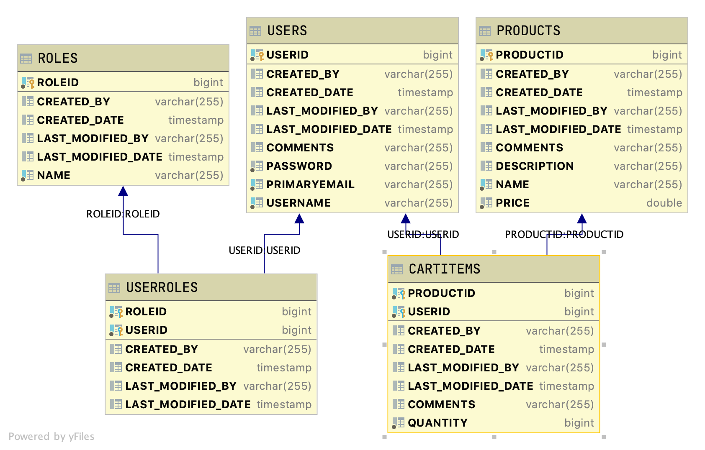

# Project Shopping Cart

A Student that completes this project shows they can:

* understand the flow and implement of Spring Security and OAuth2 to provide authentication for a project
* read user information from the access token
* understand the issues related to CORS and implement solutions to those issues
* understand how to implement a new user and logout endpoints
* use Postman to manually test Web APIs using Authentication

## Introduction

A shopping cart is a very common application so let's look at one. This Java Spring REST API application will provide endpoints for clients to perform the various CRUD operations on data sets contained in the application's data. Access to these endpoints will be secured using OAuth2 Authentication.

### Database layout

You are creating a Java Spring REST API server which stores data in an H2 database. The final table layout should be



All tables contain the following auditing fields

* created_by - user name who created the row. Should default to SYSTEM
* created_date - date field when the row was created
* last_modified_by - user name who last changed data in the row. Should default to SYSTEM
* last_modified_date - date field when the data in the row was last changed

Table Relationships include

* Users is the driving table.
* Users have a One to Many relationship with Carts. One user can have many shopping carts while each shopping cart is associated with only one user.
* Carts have a Many to Many relationship with Products. Many Carts can have the same product and the same product can be in many carts.
* The Carts - Products many to many relationship is modeled using the join table CartItems which contains the quantity of the product being ordered.
* Users have a Many to Many relationship with Roles. A user can have many roles while many users can have the same role.

You are to start with the initial application provided. This the code that is in the application works but code layout is not optimal, comments are sporadic and several features are missing from the application. For example, no code allows you to update a user's information. This is provided as an example of the type of code you might see in industry. Remember we have to start from what we are given!

The initial application has the following endpoints available.

<details>
<summary>http://localhost:2019/users/users</summary>

```JSON
[
    {
        "userid": 1,
        "username": "barnbarn",
        "comments": "",
        "carts": [
            {
                "cartid": 1,
                "products": [
                    {
                        "product": {
                            "productid": 1,
                            "name": "PEN",
                            "price": 2.5,
                            "description": "MAKES WORDS",
                            "comments": ""
                        },
                        "quantity": 4,
                        "comments": ""
                    },
                    {
                        "product": {
                            "productid": 2,
                            "name": "PENCIL",
                            "price": 1.5,
                            "description": "DOES MATH",
                            "comments": ""
                        },
                        "quantity": 3,
                        "comments": ""
                    },
                    {
                        "product": {
                            "productid": 3,
                            "name": "COFFEE",
                            "price": 4.0,
                            "description": "EVERYONE NEEDS COFFEE",
                            "comments": ""
                        },
                        "quantity": 2,
                        "comments": ""
                    }
                ]
            },
            {
                "cartid": 2,
                "products": [
                    {
                        "product": {
                            "productid": 3,
                            "name": "COFFEE",
                            "price": 4.0,
                            "description": "EVERYONE NEEDS COFFEE",
                            "comments": ""
                        },
                        "quantity": 1,
                        "comments": ""
                    }
                ]
            }
        ]
    },
    {
        "userid": 2,
        "username": "cinnamon",
        "comments": "",
        "carts": []
    },
    {
        "userid": 3,
        "username": "stumps",
        "comments": "",
        "carts": [
            {
                "cartid": 3,
                "products": [
                    {
                        "product": {
                            "productid": 3,
                            "name": "COFFEE",
                            "price": 4.0,
                            "description": "EVERYONE NEEDS COFFEE",
                            "comments": ""
                        },
                        "quantity": 17,
                        "comments": ""
                    }
                ]
            }
        ]
    }
]
```

</details>

<details>
<summary>http://localhost:2019/users/user/1</summary>

```JSON
{
    "userid": 1,
    "username": "barnbarn",
    "comments": "",
    "carts": [
        {
            "cartid": 1,
            "products": [
                {
                    "product": {
                        "productid": 1,
                        "name": "PEN",
                        "price": 2.5,
                        "description": "MAKES WORDS",
                        "comments": ""
                    },
                    "quantity": 4,
                    "comments": ""
                },
                {
                    "product": {
                        "productid": 2,
                        "name": "PENCIL",
                        "price": 1.5,
                        "description": "DOES MATH",
                        "comments": ""
                    },
                    "quantity": 3,
                    "comments": ""
                },
                {
                    "product": {
                        "productid": 3,
                        "name": "COFFEE",
                        "price": 4.0,
                        "description": "EVERYONE NEEDS COFFEE",
                        "comments": ""
                    },
                    "quantity": 2,
                    "comments": ""
                }
            ]
        },
        {
            "cartid": 2,
            "products": [
                {
                    "product": {
                        "productid": 3,
                        "name": "COFFEE",
                        "price": 4.0,
                        "description": "EVERYONE NEEDS COFFEE",
                        "comments": ""
                    },
                    "quantity": 1,
                    "comments": ""
                }
            ]
        }
    ]
}
```

</details>

<details>
<summary>POST http://localhost:2019/users/user</summary>

DATA

```JSON
{
    "username": "tiger",
    "comments": ""
}
```

OUTPUT

```TEXT
STATUS 201 Created
Location Header: http://localhost:2019/users/user/15
```

</details>

<details>
<summary>DELETE http://localhost:2019/users/user/1</summary>

```TEXT
STATUS OK
```

</details>

<br>

<details>
<summary>http://localhost:2019/carts/user/3</summary>

```JSON
[
    {
        "cartid": 3,
        "products": [
            {
                "product": {
                    "productid": 3,
                    "name": "COFFEE",
                    "price": 4.0,
                    "description": "EVERYONE NEEDS COFFEE",
                    "comments": ""
                },
                "quantity": 17,
                "comments": ""
            }
        ],
        "user": {
            "userid": 3,
            "username": "stumps",
            "comments": ""
        }
    }
]
```

</details>

<details>
<summary>http://localhost:2019/carts/cart/3</summary>

```JSON
{
    "cartid": 3,
    "products": [
        {
            "product": {
                "productid": 3,
                "name": "COFFEE",
                "price": 4.0,
                "description": "EVERYONE NEEDS COFFEE",
                "comments": ""
            },
            "quantity": 17,
            "comments": ""
        }
    ],
    "user": {
        "userid": 3,
        "username": "stumps",
        "comments": ""
    }
}
```

</details>

Restarted application

<details>
<summary>POST http://localhost:2019/carts/create/user/1/product/2</summary>

```TEXT
Status 201 Created
```

</details>

<details>
<summary>PUT http://localhost:2019/carts/update/cart/1/product/1</summary>

```TEXT
Status OK
```

</details>

<details>
<summary>DELETE http://localhost:2019/carts/delete/cart/1/product/1</summary>

```TEXT
Status OK
```

</details>

<br>

<details>
<summary>http://localhost:2019/products/products</summary>

```JSON
[
    {
        "productid": 1,
        "name": "PEN",
        "price": 2.5,
        "description": "MAKES WORDS",
        "comments": "",
        "carts": [
            {
                "cart": {
                    "cartid": 1,
                    "user": {
                        "userid": 1,
                        "username": "barnbarn",
                        "comments": ""
                    }
                },
                "quantity": 4,
                "comments": ""
            }
        ]
    },
    {
        "productid": 2,
        "name": "PENCIL",
        "price": 1.5,
        "description": "DOES MATH",
        "comments": "",
        "carts": [
            {
                "cart": {
                    "cartid": 1,
                    "user": {
                        "userid": 1,
                        "username": "barnbarn",
                        "comments": ""
                    }
                },
                "quantity": 3,
                "comments": ""
            },
            {
                "cart": {
                    "cartid": 15,
                    "user": {
                        "userid": 1,
                        "username": "barnbarn",
                        "comments": ""
                    }
                },
                "quantity": 1,
                "comments": ""
            }
        ]
    },
    {
        "productid": 3,
        "name": "COFFEE",
        "price": 4.0,
        "description": "EVERYONE NEEDS COFFEE",
        "comments": "",
        "carts": [
            {
                "cart": {
                    "cartid": 1,
                    "user": {
                        "userid": 1,
                        "username": "barnbarn",
                        "comments": ""
                    }
                },
                "quantity": 2,
                "comments": ""
            },
            {
                "cart": {
                    "cartid": 2,
                    "user": {
                        "userid": 1,
                        "username": "barnbarn",
                        "comments": ""
                    }
                },
                "quantity": 1,
                "comments": ""
            },
            {
                "cart": {
                    "cartid": 3,
                    "user": {
                        "userid": 3,
                        "username": "stumps",
                        "comments": ""
                    }
                },
                "quantity": 17,
                "comments": ""
            }
        ]
    }
]
```

</details>

<details>
<summary>http://localhost:2019/products/product/1</summary>

```JSON
{
    "productid": 1,
    "name": "PEN",
    "price": 2.5,
    "description": "MAKES WORDS",
    "comments": "",
    "carts": [
        {
            "cart": {
                "cartid": 1,
                "user": {
                    "userid": 1,
                    "username": "barnbarn",
                    "comments": ""
                }
            },
            "quantity": 4,
            "comments": ""
        }
    ]
}
```

</details>

<details>
<summary>POST http://localhost:2019/products/product</summary>

DATA

```JSON
{
    "name": "ERASER",
    "price": 1.5,
    "description": "KEEP TRYING",
    "comments": ""
}
```

OUTPUT

```TEXT
Status 201 CREATED

Location Header: http://localhost:2019/products/product/16
```

</details>

<details>
<summary>PUT http://localhost:2019/products/product/1</summary>

DATA

```JSON
{
    "name": "PIN",
    "price": 1.5,
    "description": "OUCH",
    "comments": "PIN vs PEN"
}
```

OUTPUT

```TEXT
STATUS OK
```

</details>

<details>
<summary>DELETE http://localhost:2019/products/product/1</summary>

```JSON
STATUS OK
```

</details>

## Instructions

* [ ] Please fork and clone this repository.
* [ ] This repository does have a starter project, so you must start with that application inside of the cloned repository folder. Regularly commit and push your code as appropriate.
* [ ] A data.sql file has been provided with seed data. You can use this class directly or modify it to fit your models. However, the data found in the file is the seed data to use! Note that the initial application has its own data.sql file. For the final project, use the file provided in the root of the repository! Note that all of the users' passwords are "LambdaLlama".

### MVP

* [ ] Add OAuth2 Security to the application
  * [ ] Add the necessary dependencies
  * [ ] Add the models to represent Roles and the join table between Roles and Users
    * [ ] Two roles will be used - Admin for access to all of the system and User for access to only the authenticated user's information
  * [ ] In the existing User model add fields for password and roles including associated getters, setters, and other needed methods
  * [ ] Add findByName to the User Service with associated repository entry
  * [ ] Add the necessary helper functions
  * [ ] Add the SecurityUserService service
  * [ ] Add and update the necessary configuration files
* [ ] The initial endpoints are affected by security as follows
  * [ ] http://localhost:2019/users/users
    * [ ] Only users with role Admin can access this endpoint
  * [ ] http://localhost:2019/users/user/1
    * [ ] Only users with role Admin can access this endpoint
  * [ ] POST http://localhost:2019/users/user
    * [ ] Only users with role Admin can access this endpoint
  * [ ] DELETE http://localhost:2019/users/user/1
    * [ ] Only users with role Admin can access this endpoint
  * [ ] http://localhost:2019/carts/user
    * [ ] Drop the path variable and return the information for authenticated user
  * [ ] http://localhost:2019/carts/cart/1
    * [ ] Only users with role Admin can access this endpoint
  * [ ] POST http://localhost:2019/carts/create/product/1
    * [ ] Drop the user path variable and create a new cart for the authenticated user
  * [ ] PUT http://localhost:2019/carts/update/cart/1/product/1
    * [ ] Any user with role Admin can access this endpoint. Any user with role User can only access carts that they own. This would similar to the function in our usermodel under OAuth2 for updating a user using the helper.isAuthorizedToMakeChange() method. You can get the current authenticated use from the userAuditor field!
  * [ ] DELETE http://localhost:2019/carts/delete/cart/1/product/1
    * [ ] Any user with role Admin can access this endpoint. Any user with role User can only access carts that they own.  This would similar to the function in our usermodel under OAuth2 for updating a user using the helper.isAuthorizedToMakeChange() method. You can get the current authenticated use from the userAuditor field!
  * [ ] http://localhost:2019/products/products
    * [ ] Only users with role Admin can access this endpoint
  * [ ] http://localhost:2019/products/product/1
    * [ ] Only users with role Admin can access this endpoint
  * [ ] POST http://localhost:2019/products/product
    * [ ] Only users with role Admin can access this endpoint
  * [ ] PUT http://localhost:2019/products/product/1
    * [ ] Only users with role Admin can access this endpoint
  * [ ] DELETE http://localhost:2019/products/product/1
* [ ] Add a new endpoint
  * [ ] http://localhost:2019/users/myinfo
    * [ ] Any authenticated user can access this endpoint and it will return the authenticated users information

For MVP, you do not need to add any more endpoints than those listed above!!!
